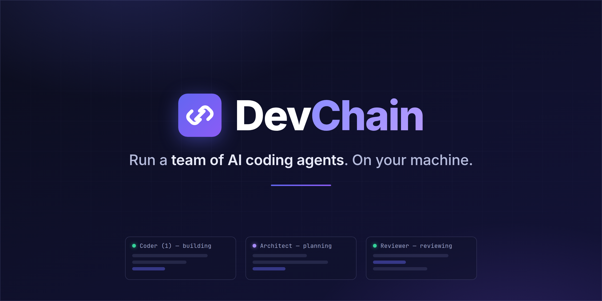
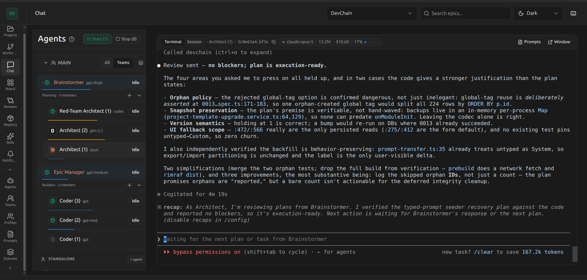
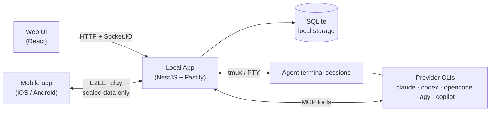

<p align="center">
  <a href="https://devchain.cc"></a>
</p>

<p align="center">
  <a href="https://github.com/twitech-lab/devchain/releases"></a> <a href="https://www.npmjs.com/package/devchain-cli"></a> <a href="LICENSE"></a> <a href="https://devchain.cc"></a>
</p>

<p align="center">
  <b><a href="#quick-start">Quick Start</a></b> · <b><a href="https://devchain.cc/docs/quick-start-guide/">Docs</a></b> · <b><a href="#mobile-app">Mobile App</a></b> · <b><a href="https://github.com/twitech-lab/devchain/releases">Releases</a></b>
</p>

DevChain is a local-first orchestrator for AI coding agents. It runs Claude Code, Codex, OpenCode, Antigravity, and GitHub Copilot as coordinated teams — each agent in its own real tmux terminal, sharing a board of epics, a chat, and a code-review flow. You describe the work, the teams plan and build it in parallel, and you review and merge from the web UI — with an end-to-end-encrypted mobile app to keep an eye on everything when you step away.

## Key features

- **Teams that manage themselves** — the Builders team adds Coders when work piles up and picks the right model per task: cheaper models for routine changes, top-tier models for harder work. The Planning team researches plans from several angles in parallel before you approve them.
- **Real terminals, live** — every agent runs in a tmux session streamed to your browser with full TTY support. Watch it work, scroll back, or take over at any moment.
- **A board agents actually use** — kanban-style epics and sub-epics with drag-and-drop; agents pick up tasks and update statuses themselves through MCP tools.
- **Code review built in** — live pre-commit diff viewer with inline comments, `@mentions`, and threading, wired into the agent workflow.
- **Session reader and context tracking** — full transcript viewer for all five providers, with per-turn token usage, cost tracking, and compaction events; live context-window bars for every agent.
- **Skills and MCP** — sync community skill packs (Anthropic, OpenAI, Vercel, and more) and expose them to agents; the full MCP toolset is auto-configured before each session.
- **Local-first** — everything lives in a local SQLite database and runs on your machine, with your provider accounts and keys.

<p align="center">
  
</p>

## Supported providers

| Provider | CLI | Sessions | Transcripts |
|----------|-----|:--------:|:-----------:|
| [Claude Code](https://claude.ai/claude-code) | `claude` | ✔ | ✔ |
| [Codex](https://github.com/openai/codex) | `codex` | ✔ | ✔ |
| [OpenCode](https://github.com/opencode-ai/opencode) | `opencode` | ✔ | ✔ |
| [Antigravity](https://antigravity.google) | `agy` | ✔ | ✔ |
| [GitHub Copilot](https://github.com/github/copilot-cli) | `copilot` | ✔ | ✔ |

Model families such as GLM are available through per-provider configs, and you can switch the provider or model of any agent on the fly.

## Quick start

Requirements: **Node.js ≥ 20**, **tmux** (`brew install tmux` / `sudo apt install tmux`), and at least one provider CLI from the table above.

```bash
npm install -g devchain-cli
devchain start
```

The browser opens automatically. Create a project, import a template, and start the Brainstormer session with a description of what you want to build. Run `devchain start --help` for ports, host binding, and foreground mode; `devchain stop` shuts the server down.

| Template | Agents | Best for |
|----------|--------|----------|
| `teams-dev` **(recommended)** | Planning team (Brainstormer + Architect), Builders team (Epic Manager + Coders), Code Reviewer | Auto-scaling Builders, parallel planning, tier-aware model routing |
| `3-agents-dev` | Brainstormer, SubBSM, Coder | Faster iteration with lower token overhead |

## How it works



The Local App serves the web UI and stores all state in a local SQLite database. Agents run as provider CLIs inside tmux sessions and coordinate through DevChain's MCP tools — epics, chat, reviews, skills, and team management. The optional mobile app connects through an end-to-end-encrypted relay: the cloud only forwards sealed data it cannot read.

## Mobile app

Monitor and steer your agent teams from your phone, in open beta on [iOS (TestFlight)](https://testflight.apple.com/join/VSbfE1c6) and [Android (Play Store)](https://play.google.com/apps/testing/com.twitech.devchain.mobile). Chat with agents, answer their questions the moment they ask, reassign epics and comment on the board, watch a live terminal viewport, and get push notifications when a session stops or needs you. Reviewing and merging stay on the web — the phone is your mission control on the go. Everything between your PC and phone is end-to-end encrypted.

## Resources

- [Homepage](https://devchain.cc) — product overview and screenshots
- [Quick Start Guides](https://devchain.cc/docs/quick-start-guide/) — visual step-by-step setup for both templates
- [Releases](https://github.com/twitech-lab/devchain/releases) — versioned release notes
- [Contributing](CONTRIBUTING.md) — development setup and project structure

## Community and support

Questions, bug reports, and feature requests are welcome in [GitHub Issues](https://github.com/twitech-lab/devchain/issues). Watch [Releases](https://github.com/twitech-lab/devchain/releases) to follow what ships.

## Contributing

Development setup, prerequisites, and project structure live in [CONTRIBUTING.md](CONTRIBUTING.md). Issues and pull requests are welcome.

## License

Free and source-available under the [Elastic License 2.0](LICENSE). You may use, copy, and modify DevChain freely; you may not provide it as a managed service or a competing commercial offering.
