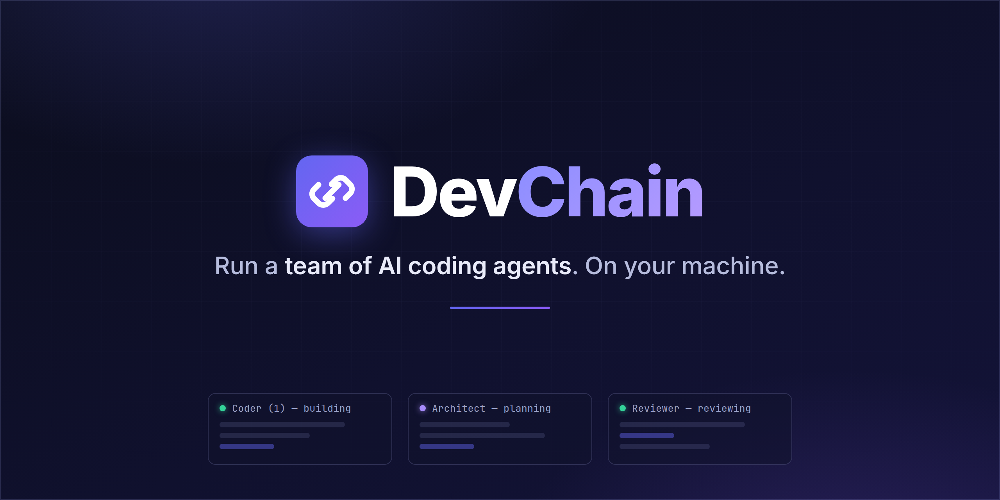
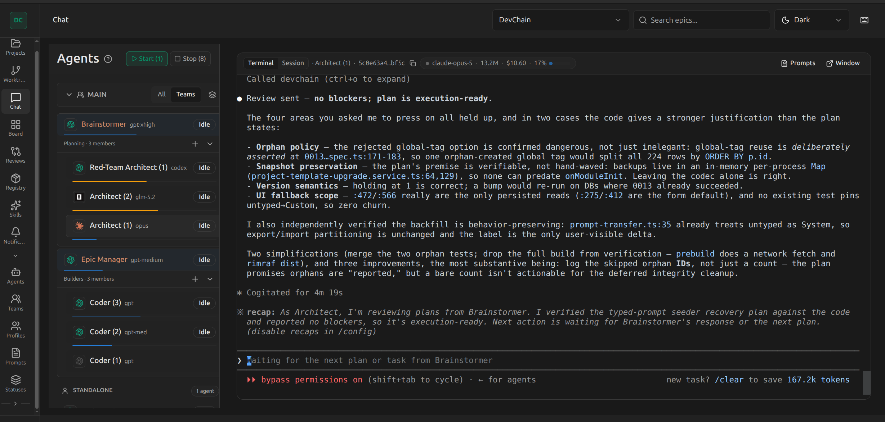
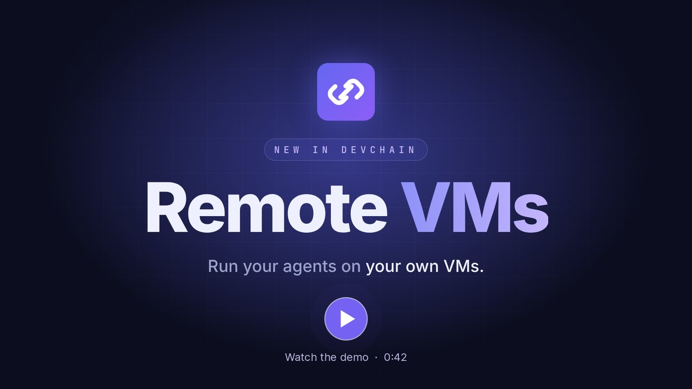
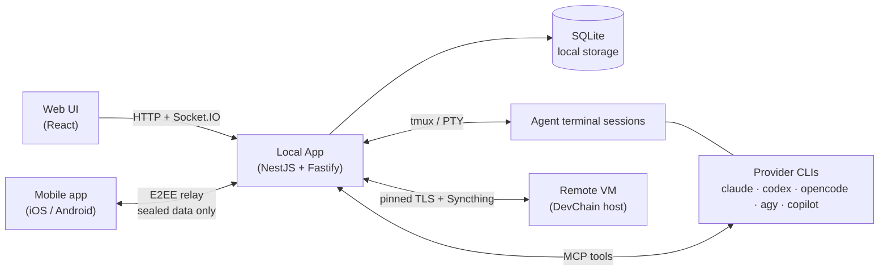

<p align="center">
  <a href="https://devchain.cc"></a>
</p>

<p align="center">
  <a href="https://github.com/twitech-lab/devchain/releases"></a> <a href="https://www.npmjs.com/package/devchain-cli"></a> <a href="LICENSE"></a> <a href="https://devchain.cc"></a>
</p>

<p align="center">
  <b><a href="#quick-start">Quick Start</a></b> · <b><a href="#remote-vms">Remote VMs</a></b> · <b><a href="https://devchain.cc/docs/quick-start-guide/">Docs</a></b> · <b><a href="#mobile-app">Mobile App</a></b> · <b><a href="https://github.com/twitech-lab/devchain/releases">Releases</a></b>
</p>

DevChain runs a team of AI coding agents on your own hardware. Claude Code, Codex, OpenCode, Antigravity, and GitHub Copilot work as coordinated teams, each agent in its own real terminal, with a shared board, chat, and code review.

You describe the work. The agents plan it, build it in parallel, and hand it to you for review. Run them on your PC, or move a project to your own VM and let your laptop sleep.

## Key features

- **Self-managing teams.** The Planning team researches a plan from several angles before you approve it. The Builders team adds Coders when work piles up and picks a cheaper or stronger model for each task.
- **Real terminals, live.** Every agent runs in its own tmux session, streamed to your browser. Watch it work, scroll back, or take over at any time.
- **A board agents use.** Agents pick up epics and sub-epics and update their status themselves through MCP tools.
- **Built-in code review.** A live pre-commit diff with inline comments, `@mentions`, and threads, wired into the agent workflow.
- **Remote VMs.** Move a project to a Proxmox VM or any Ubuntu or Debian VM you own. The agents keep working when you close the laptop.
- **Transcripts and costs.** A session reader for all five providers, with token usage, cost, and a live context bar for every agent.
- **ClickUp and Jira.** Import assigned tasks as epics, keep statuses and subtasks in sync, and log time without leaving the app.
- **Skills and MCP.** Sync community skill packs (Anthropic, OpenAI, Vercel, and more) for your agents. DevChain configures its MCP tools before each session.
- **Local-first.** Your data stays in a local SQLite database on your machines, and agents use your own provider accounts.

<p align="center">
  
</p>

## Quick start

Requirements: **Node.js 24 or newer**, **tmux** (`brew install tmux` / `sudo apt install tmux`), and at least one [provider CLI](#supported-providers).

```bash
npm install -g devchain-cli
devchain start
```

DevChain opens in your browser:

1. Create a project.
2. Import the `teams-dev` template: a Planning team (Brainstormer and Architects), a Builders team (Epic Manager and Coders), and a Code Reviewer.
3. Start the Brainstormer and describe what you want to build.

`devchain start --help` lists the port, host, and foreground options. `devchain stop` stops the server. CI tests DevChain on Linux x64 with Node 24, plus a Node 26 compatibility lane. The install checks that SQLite loads on your platform and stops if it does not; `DEVCHAIN_SKIP_POSTINSTALL=1` skips that check.

## Remote VMs

<p align="center">
  <a href="https://devchain.cc/features/remote-vms.mp4"></a>
</p>

Move a project to your own VM and keep working from the same app. The agents keep running when your laptop sleeps, and the mobile app can tell you when the work is done.

1. **Add a VM.** Create one on a connected Proxmox server, or add an Ubuntu or Debian VM over SSH from **Cloud → Remote VMs** (or with `devchain host install`). DevChain sets up the VM with itself, the provider CLIs, and the logins you choose.
2. **Connect a project.** DevChain copies the project to the VM and keeps its files in sync both ways with Syncthing.
3. **Work as usual.** The board, chat, and agent terminals stay in the home app, and the agents run on the VM. **Disconnect** brings the project back to your PC.

Before you start:

- Use a LAN or VPN between your PC and the VM. Your PC reaches every VM with an API key, over TLS pinned to the VM's own certificate ([details](https://devchain.cc/releases/0.24.0/#secure-connection-to-every-vm)).
- Install [Syncthing v2](https://syncthing.net) on your PC. DevChain installs it on the VM.
- For your own VM, use a dedicated headless VM: Ubuntu 22.04+ or Debian 12+, amd64, and at least 4 GiB of RAM.
- To follow a VM's projects in the mobile app, sign the VM in to DevChain Cloud from the **Cloud** page.

## Supported providers

| Provider                                                | CLI        |
| ------------------------------------------------------- | ---------- |
| [Claude Code](https://claude.ai/claude-code)            | `claude`   |
| [Codex](https://github.com/openai/codex)                | `codex`    |
| [OpenCode](https://github.com/opencode-ai/opencode)     | `opencode` |
| [Antigravity](https://antigravity.google)               | `agy`      |
| [GitHub Copilot](https://github.com/github/copilot-cli) | `copilot`  |

Every provider gets live terminal sessions and full transcripts. Model families such as GLM are available through provider configs, and you can switch the provider or model of any agent at any time.

## How it works


```mermaid
graph LR
    Browser["Web UI<br/>(React)"] -->|HTTP + Socket.IO| App["Local App<br/>(NestJS + Fastify)"]
    App --> DB[("SQLite<br/>local storage")]
    App <-->|tmux / PTY| Sessions["Agent terminal sessions"]
    Sessions --- CLIs["Provider CLIs<br/>claude · codex · opencode · agy · copilot"]
    CLIs <-->|MCP tools| App
    Mobile["Mobile app<br/>(iOS / Android)"] <-->|E2EE relay<br/>sealed data only| App
    App <-->|pinned TLS + Syncthing| VM["Remote VM<br/>(DevChain host)"]
```

The Local App serves the web UI and keeps all state in a local SQLite database. Agents run as provider CLIs in tmux sessions and coordinate through DevChain's MCP tools: epics, chat, reviews, skills, and team management. A Remote VM runs its own DevChain. The Local App sends a connected project's requests to it over TLS pinned to the VM's certificate, and Syncthing keeps the project files in sync over its own encrypted connection. The optional mobile app connects through an end-to-end-encrypted relay that only forwards sealed data it cannot read.

## Mobile app

Follow and steer your agent teams from your phone. The app is in open beta on [iOS (TestFlight)](https://testflight.apple.com/join/VSbfE1c6) and [Android (Play Store)](https://play.google.com/apps/testing/com.twitech.devchain.mobile).

Chat with agents, answer their questions as they ask, reassign epics, comment on the board, watch a live terminal, and get a push notification when a session stops or needs you. Review and merge stay on the web. Everything between your PC and your phone is end-to-end encrypted.

## Resources

- [Homepage](https://devchain.cc): product overview and screenshots
- [Quick start guide](https://devchain.cc/docs/quick-start-guide/): step-by-step visual setup
- [Releases](https://github.com/twitech-lab/devchain/releases): release notes for each version
- [GitHub Issues](https://github.com/twitech-lab/devchain/issues): questions, bug reports, and feature requests
- [Contributing](CONTRIBUTING.md): development setup and project structure; issues and pull requests are welcome

## License

Free and source-available under the [Elastic License 2.0](LICENSE). You may use, copy, and modify DevChain freely. You may not provide it as a managed service or a competing commercial offering.
